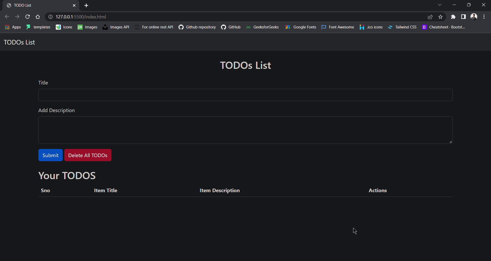

# TODOs List using Javascript

Todo Link - https://rahulgit24.github.io/TODO-List/

# Working of Application

Submit your TODOs

You can delete all TODOs after completing the tasks

You can delete one TODO after completing that task

# Screenshot of Application

<h4> You can follow me on Instagram for various projects on web development and basic DSA questions</h4>

